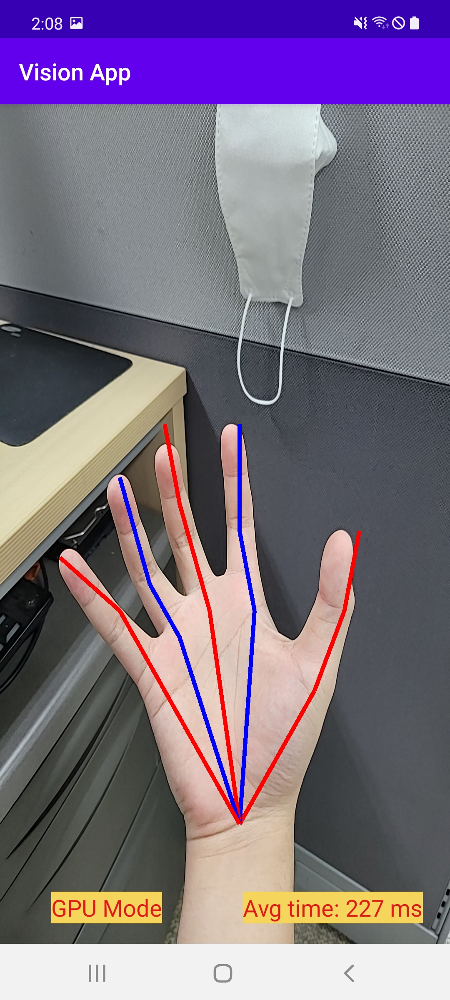

# pytorch_android


## Introduction
In this project I deploy 3 models on Android and inference with CPU/GPU:
  - Image classification with mobilenet_v2
  - Object Detection with yolov5 
  - Handpose Estimation with detnet (The model and pretrained weight from https://github.com/MengHao666/Minimal-Hand-pytorch, with minor modification)

This work follows the deployment workflow: https://pytorch.org/mobile/home/ and https://pytorch.org/tutorials/prototype/vulkan_workflow.html

## Install:
### 1. Running on Android CPU:

You might want to try running the models on CPU first. To do that, in build.gradle file in app folder, comment lines 48,49 and uncomment lines 50,51 to use the official release pytorch lib. In the activity files, use LiteModuleLoader to load the .ptl model. 

The ready-to-use models are in app/src/main/assets, if you want to generate the model by yourself, refer to the convert script for each model in script_model folder.

   

### 2. Running on Android GPU:
Vulkan runtime library on Android can support running DL operations on Android GPU, we need to build the Android libtorch and the model itself that can run with Vulkan.

## Update:
*Recently I worked on this again so I share some experiences when compiling pytorch and libtorch for vulkan. *

The release torch version installed by pip will not work when generating vulkan-supported models or even if it can generate, the models won't work. We need to build torch from source with vulkan enable and then use that torch to generate the models.
* Build and install pytorch that support vulkan:

Environment:\
  Ubuntu 18.04 \
  clang 12.0\
  Torch source code version: v2.0.0 ( by git checkout tags/v2.0.0)\
  Vulkan SDK version: 1.3.216.0\
  CUDA 11.7\
  cmake 3.26.5\

Install steps:

Install Vulkan SDK first : https://vulkan.lunarg.com/sdk/home#linux. Download the tar file, unzip and then ```source ~/vulkan/1.x.yy.z/setup-env.sh```
Replace x,y,z with your version

Create separated conda environment:
```
conda create --name torch_vulkan python=3.8
conda activate torch_vulkan
conda install numpy pyyaml mkl mkl-include setuptools cmake cffi  typing typing_extensions
export CMAKE_PREFIX_PATH="$HOME/anaconda3/envs/torch_vulkan"
sudo apt-get install libomp-dev
```
Then clone source code:
```
cd ~
git clone --recursive https://github.com/pytorch/pytorch
git checkout tags/v2.0.0 (can choose other torch version)
git submodule sync
git submodule update --init --recursive
```
Set CUDA env: (mine is 11.7)
```export CUDA_NVCC_EXECUTABLE="/usr/local/cuda-11.7/bin/nvcc"
export CUDA_HOME="/usr/local/cuda-11.7"
export CUDNN_INCLUDE_PATH="/usr/local/cuda-11.7/include/"
export CUDNN_LIBRARY_PATH="/usr/local/cuda-11.7/lib64/"
export LIBRARY_PATH="/usr/local/cuda-11.7/lib64"
```
Then install

```USE_VULKAN=ON CC=clang CXX=clang++ python setup.py install```.

Finishing by:

```python setup.py develop ``` then:

```pip install .```

Check torch version just built: ```python -c "import torch; print(torch.__version__)"```

If any step fails, fix the problem, remove the ```build``` and rerun setup.py install

After building and installing the built torch, we can convert model to torchscript vulkan model by specify ```backend=’vulkan’ ``` in ```optimize_for_mobile()``` ( see in the convert script)

* Build pytorch lib with vulkan support:

We also need to build the pytorch android lib that support vulkan. Follow this: https://pytorch.org/mobile/android/#building-pytorch-android-from-source. My detail installation is below:

Dependencies versions: \
Android NDK r21e \
Java version: 11 Openjdk\
gradle 6.8.2\
( I experienced problems when compiling using Java 17 and gradle >=7.0 so I tried these and it worked.)   
Setting the environment variable like below. Whereas the ANDROID_HOME is where you download and unpack the android commandline-tools (unzip the file, rename into ```tools```, and move to ```cmdline-tools``` folder). My ```~/.bashrc``` file will have this:\
```
ANDROID_HOME="/hdd/ktdinh/AndroidSDK"
ANDROID_NDK="/hdd/ktdinh/Download/android-ndk-r21e"
GRADLE_HOME="/hdd/ktdinh/Download/gradle-6.8.2"
JAVA_HOME="/usr/lib/jvm/java-11-openjdk-amd64"
export ANDROID_HOME
export ANDROID_NDK
export GRADLE_HOME
export JAVA_HOME
export PATH=/hdd/ktdinh/Download/cmake-3.26.5-linux-x86_64/bin:$PATH
export PATH=$JAVA_HOME/bin:$ANDROID_HOME/cmdline-tools/tools/bin:$ANDROID_HOME/platform-tools:$PATH
```

Clone a new pytorch repo:

```git clone --recursive https://github.com/pytorch/pytorch```
Checkout to the torch version that we also use to generate the model: (mine is torch 2.0.0)
```
git checkout tags/v2.0.0 (can choose other torch version)
git submodule sync
git submodule update --init --recursive
```

Then build the libtorch for your target architecture (for e.g arm64-v8a) by:

```USE_VULKAN=1   ./scripts/build_pytorch_android.sh arm64-v8a```

Then copy the generated arrs to app/lib in android project folder and include it in build.gradle file.

* Use the model

Vulkan model can be loaded with method ```LiteModuleLoader.load```, so use this method to load the model in activity files.

Result:

 

You can see that the inference time reduces for around 40%.

However, when I try yolov5 model, this error happened: 
```
RuntimeError: falseINTERNAL ASSERT FAILED at "/home/ncl/ktdinh/pytorch/aten/src/ATen/native/vulkan/ops/Tensor.cpp":255, please report a bug to PyTorch. Only Tensors with 1 <= dim <= 4 can be represented as a Vulkan Image!
```
It looks like a limitation of vulkan when not supporting tensor that has more than 4 dimensions. Also, currently vulkan backend doesn't support many operations. Let's wait for the future update!

