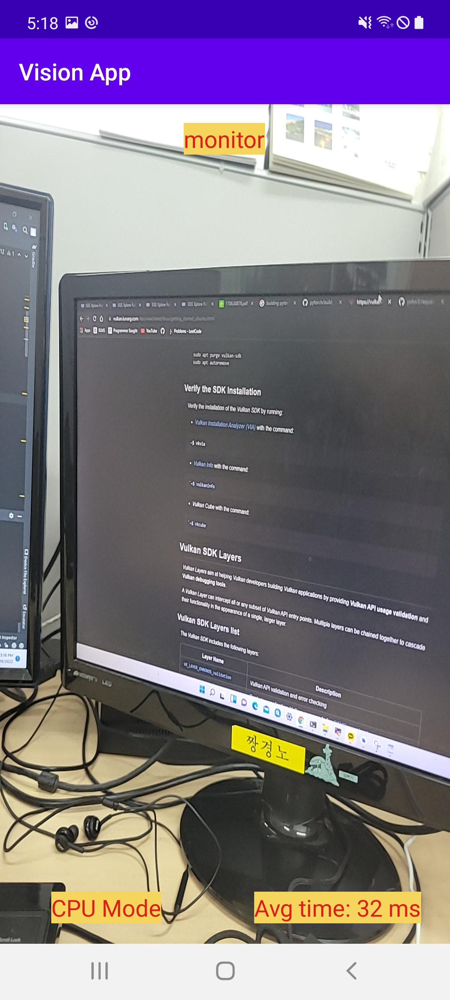
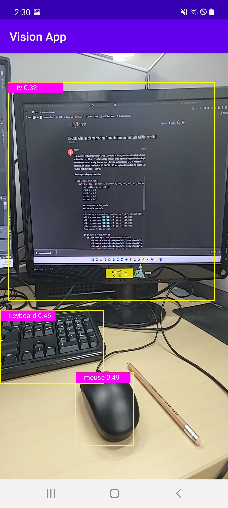
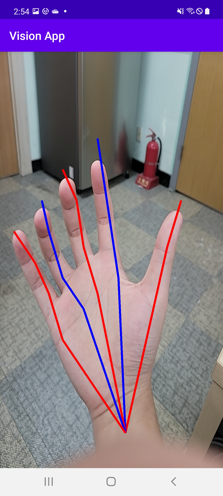
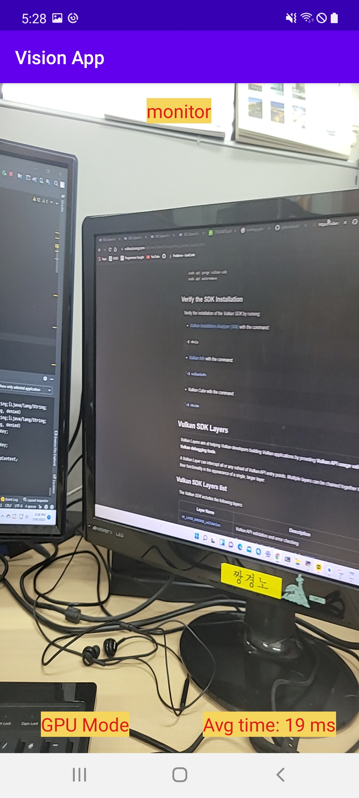

# pytorch_android

## Introduction
In this project I implemented 3 models on Android:
  - Image classification with mobilenet_v2
  - Object Detection with yolov5 
  - Handpose Estimation with detnet (The model and pretrained weight from https://github.com/MengHao666/Minimal-Hand-pytorch, with minor modification)

This work follows on https://pytorch.org/tutorials/prototype/vulkan_workflow.html

## Running step
### 1. Running on Android CPU:

You might want to try running the models on CPU first. For that, in build.gradle file in app folder, comment lines 48,49 and uncomment lines 50,51 to use the official release pytorch lib. In the activity files, use LiteModuleLoader to load the .ptl model. 

You can use the provided models in app/src/main/assets, but if you want to generate the model yourself, refer to the convert script for each model in script_model folder.





### 1. Running on Android GPU:
We need to follow these steps:
* Prepare vulkan-supported model:

The release torch version installed by pip will not work when generating vulkan-supported model. We need to build torch from source with vulkan enable.

Install Vulkan SDK first : https://vulkan.lunarg.com/sdk/home#linux, then follow this link https://medium.com/repro-repo/build-pytorch-from-source-on-ubuntu-18-04-1c5556ca8fbf. In the install step, install torch with

```USE_VULKAN=ON CC=clang CXX=clang++ python setup.py install```.

Finishing by

```python setup.py develop && python -c "import torch" ``` then

```pip install .```

Check torch version just built: ```python -c "import torch; print(torch.__version__)"```

After building and installing the built torch, we can convert model to torchscript vulkan model by specify ```backend=’vulkan’ ``` in ```optimize_for_mobile()``` ( see in the convert script)

* Build pytorch lib with vulkan support:

Install Android NDK, SDK, Java beforehand. You should install NDK version r21e, the newer versions change the file hierachy so it's not compatible with the pytorch source.

Then, clone the pytorch repo:

```git clone --recursive https://github.com/pytorch/pytorch```

For some reason, LiteModuleLoader has't support vulkan model, so we build the library without lite interpreter support:

```ANDROID_ABI=arm64-v8a USE_VULKAN=1 BUILD_LITE_INTERPRETER=0 ./scripts/build_android.sh```

```USE_VULKAN=1 BUILD_LITE_INTERPRETER=0  ./scripts/build_pytorch_android.sh arm64-v8a```

Then copy the generated arrs to app/lib in android project folder and include it in build.gradle file.

* Use the model

Vulkan model only works with old method ```Module.load```, so use this method to load the model in activity files.

Mobilenet_v2 result:



When trying yolov5 and detnet model, this error happened: 
```
RuntimeError: falseINTERNAL ASSERT FAILED at "/home/ncl/ktdinh/pytorch/aten/src/ATen/native/vulkan/ops/Tensor.cpp":255, please report a bug to PyTorch. Only Tensors with 1 <= dim <= 4 can be represented as a Vulkan Image!
```
It seems a limit of vulkan when not supporting tensor that has more than 4 dimensions. Let's wait for the future pytorch update!

